# Chrona Twin — System Architecture Diagram

```mermaid
---
title: Chrona Twin — System Architecture
---
graph TB
    %% ===== External Actors =====
    Browser["🌐 Browser<br/>Tactical UI<br/>(Cesium + Leaflet)"]
    ExtAPIs["🔗 External APIs<br/>OpenSky, USGS, CelesTrak,<br/>News, Weather, Maritime..."]

    subgraph "Docker Compose Deployment"
        %% ===== Application Layer =====
        subgraph "Apps (Entrypoints)"
            API["📡 API Server<br/>apps/api<br/>Port 3000<br/>Native Node.js HTTP"]
            WEB["🖥️ Web Server<br/>apps/web<br/>Port 3001<br/>Static Assets + Cesium"]
            WORKER["⚙️ Ingestion Worker<br/>apps/worker<br/>Fixture / Intel"]
            AGENT_COL["🔍 Agent: Collector<br/>apps/agents<br/>Data Gathering"]
            AGENT_DET["📊 Agent: Detector<br/>apps/agents<br/>Anomaly Detection"]
            AGENT_PUB["📢 Agent: Publisher<br/>apps/agents<br/>Insight Publishing"]
        end

        %% ===== Package Layer =====
        subgraph "Packages (Business Logic)"
            CONTRACTS["📦 contracts<br/>Shared Types &amp; Schemas"]
            DOMAIN["🧮 domain<br/>Deterministic State Projection"]
            INGESTION["📥 ingestion<br/>Validation &amp; Dedup"]
            ALERTS["🔔 alerts<br/>Rule Engine"]
            SWAN["🧠 swan<br/>Advisory Protocol"]
            REPLAY["⏪ replay<br/>Query Validation"]
            EXTERNAL_DATA["🌍 external-data<br/>20+ Data Adapters"]
            INTELLIGENCE["📰 intelligence<br/>Incident Intel"]
            LIVE_WORLD["✈️ live-world<br/>Snapshot Cache"]
            ADAPTERS["🔌 adapters<br/>Input Normalization"]
            CORRELATION["🔗 correlation<br/>Cross-Domain Signals"]
            UICOMP["🎨 ui-components<br/>Widget Library"]
            AGENTS_PKG["🤖 agents (pkg)<br/>Coordinator + EventBus"]
            TEST_FIXTURES["🧪 test-fixtures<br/>Golden Data"]
        end

        subgraph "Infrastructure Packages"
            CONFIG["⚙️ config<br/>Environment"]
            PERSISTENCE["🗄️ persistence<br/>Database Gateway"]
            LOGGING["📝 logging<br/>Structured Logger"]
            AUTH["🔐 auth<br/>Authentication"]
        end

        %% ===== Data Infrastructure =====
        subgraph "External Infrastructure"
            PG[("🐘 PostgreSQL + PostGIS<br/>Port 5432<br/>14 Migration Schemas")]
            REDIS[("📮 Redis<br/>Port 6379<br/>Cache + Agent Bus")]
        end
    end

    %% ===== Relationships =====

    %% Client Connections
    Browser -->|"Static Assets"| WEB
    Browser -->|"REST + SSE (Live Events)"| API

    %% App → Package dependencies
    API --> AUTH
    API --> CONTRACTS
    API --> PERSISTENCE
    API --> LOGGING
    API --> CONFIG
    API --> INGESTION
    API --> DOMAIN
    API --> ALERTS
    API --> SWAN
    API --> REPLAY
    API --> EXTERNAL_DATA
    API --> INTELLIGENCE
    API --> LIVE_WORLD
    API --> CORRELATION

    WORKER --> CONTRACTS
    WORKER --> INGESTION
    WORKER --> PERSISTENCE
    WORKER --> CONFIG
    WORKER --> LOGGING
    WORKER --> TEST_FIXTURES

    AGENT_COL --> AGENTS_PKG
    AGENT_DET --> AGENTS_PKG
    AGENT_PUB --> AGENTS_PKG
    AGENTS_PKG --> PERSISTENCE
    AGENTS_PKG --> REDIS

    %% Package → Package dependencies
    INGESTION --> ADAPTERS
    INGESTION --> CONTRACTS
    INGESTION --> DOMAIN
    INGESTION --> PERSISTENCE

    EXTERNAL_DATA --> CONTRACTS
    EXTERNAL_DATA --> PERSISTENCE

    CORRELATION --> CONTRACTS
    CORRELATION --> PERSISTENCE

    INTELLIGENCE --> CONTRACTS
    INTELLIGENCE --> PERSISTENCE
    INTELLIGENCE --> LOGGING

    ALERTS --> CONTRACTS
    ALERTS --> DOMAIN

    SWAN --> CONTRACTS
    SWAN --> PERSISTENCE
    SWAN --> LOGGING

    DOMAIN --> CONTRACTS

    LIVE_WORLD --> REDIS

    REPLAY --> CONTRACTS

    %% Persistence → Database
    PERSISTENCE --> PG

    %% External integrations
    API -->|"REST polling"| ExtAPIs
    EXTERNAL_DATA -->|"REST fetching"| ExtAPIs
    INTELLIGENCE -->|"GDELT / Openverse"| ExtAPIs

    %% Agent internal pipelines
    AGENT_COL -.->|"produces tasks"| AGENTS_PKG
    AGENTS_PKG -.->|"claims tasks"| AGENT_DET
    AGENTS_PKG -.->|"claims tasks"| AGENT_PUB
    AGENT_DET -.->|"publishes insights"| AGENTS_PKG
    AGENT_PUB -.->|"publishes events"| AGENTS_PKG
```

## Component Descriptions

### Application Layer (`apps/`)

| Component | Role |
|---|---|
| **API Server** | HTTP + SSE backend handling auth, ingestion, state queries, replay, alerts, incidents, SWAN, external layers, and live events. Native Node.js `http.createServer()`. |
| **Web Server** | Static asset host for the tactical UI (Cesium 3D globe + Leaflet 2D fallback). Plain HTML/CSS/JS. |
| **Ingestion Worker** | One-shot CLI for fixture loading and incident intelligence sweeps. |
| **Agents** | Long-running swarm of collector → detector → publisher workers sharing a `BaseAgentWorker` base class. |

### Package Layer (`packages/`)

| Component | Role |
|---|---|
| **contracts** | Canonical type definitions (models, schemas, versions) shared across all packages. |
| **domain** | Pure deterministic state projection — core replay engine. |
| **ingestion** | Validates, deduplicates, quarantines, and writes canonical events. |
| **alerts** | Rule engine evaluating events + state against alert conditions. |
| **swan** | Advisory intelligence protocol — opt-in sessions, findings, artifacts. |
| **replay** | Validates replay time-window queries (7-day max). |
| **external-data** | 20+ adapters for geospatial, financial, news, and cybersecurity data sources. |
| **intelligence** | Incident intelligence from GDELT, Openverse, YouTube. |
| **live-world** | In-memory/Redis cache for live flight snapshots. |
| **correlation** | Multi-layer spatial convergence and velocity spike detection. |
| **ui-components** | Reusable Cesium widgets (AlertBadge, ClusterWidget, RouteLine, etc.). |
| **agents (pkg)** | Shared agent infrastructure: coordinator, event bus, types. |
| **persistence** | Database gateway/repository for all PostgreSQL interaction (14 migration schemas). |
| **config** | Validated environment variable configuration. |
| **auth** | Username/password auth with bearer tokens and role-based access. |
| **logging** | JSON-structured logging with in-memory ring buffer for SSE log streaming. |

### Infrastructure

| Component | Role |
|---|---|
| **PostgreSQL + PostGIS** | Primary data store — append-only event store, spatial queries, 14 migration schemas. |
| **Redis** | Cache layer (live world snapshots) + agent inter-process event bus. |
| **Docker Compose** | Production deployment — multi-stage Alpine builds for all services. |

## Key Data Flows

1. **Live Ingest**: Client → API → Ingestion → Persistence → Domain (projection) → Alerts → SSE fanout
2. **Replay**: Client → API → Persistence (fetch events) → Domain (project) → Response
3. **Live World**: API → OpenSky API → Live World Cache → SSE → Browser
4. **External Layers**: API → External Data Adapters → Persistence → SSE → Browser
5. **Agent Pipeline**: Collector → (Redis bus) → Detector → (Redis bus) → Publisher → DB → UI
6. **SWAN Advisory**: Browser → API → SWAN Protocol → Persistence → Advisory events → SSE

## Architectural Patterns

- **Modular Monolith**: Clean package boundaries, single deployment unit
- **Event-Driven**: Append-only event store → state projection → alert evaluation → SSE fanout
- **CQRS Tendency**: Separate command (ingestion/state write) and query (replay/state read) paths
- **Event Sourcing**: `canonical_events` is append-only; `latest_object_states` is a derived projection
- **Swarm Architecture**: Three specialized agent types forming a pipeline via Redis event bus
- **Adapters Pattern**: `packages/external-data` normalizes diverse external sources into a common format
